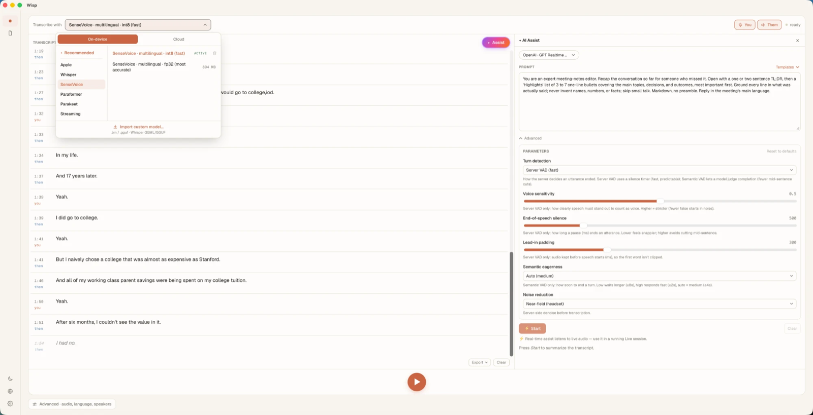
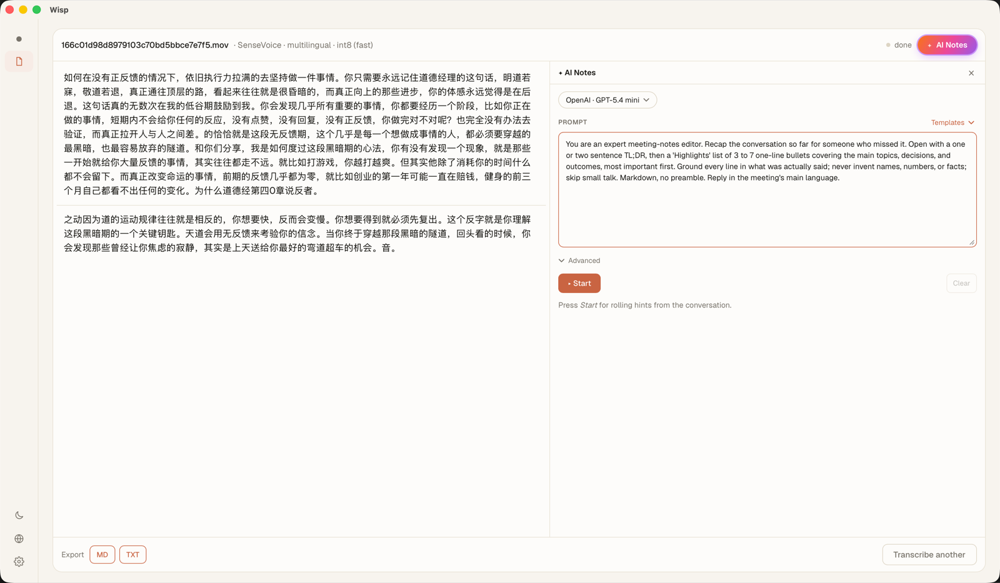

<div align="center">

<picture>
  <source media="(prefers-color-scheme: dark)" srcset="branding/wisp-wordmark-reverse.svg">
  
</picture>

### Local-first, real-time meeting transcription — on-device, private, GPU-accelerated.

Your microphone **and** the meeting's audio become a live, per-speaker transcript with an AI copilot beside it — entirely on your machine. No cloud. No upload. No account.

<br>

[](https://github.com/ppXD/Wisp/actions/workflows/ci.yml)
[](https://github.com/ppXD/Wisp/releases)
[](#-install)
[](https://www.rust-lang.org)
[](https://tauri.app)
[](#-license)

**English** · [简体中文](README.zh-Hans.md)

<br>

[](https://github.com/ppXD/Wisp/releases)
&nbsp;
[](https://github.com/ppXD/Wisp/releases)

<br>



</div>

---

**Wisp** turns any conversation into a clean, timestamped, speaker-labelled transcript in real time — and runs a live AI assistant alongside it. Every byte of audio and every model stays on your device by default. It installs in seconds, needs **zero** extra setup (no virtual audio drivers, no kernel extensions), and is tuned to the metal on each platform — Metal + the Neural Engine on Apple Silicon, native loopback on Windows.

> 🔒 **Private by design** · ⚡ **Optimized to the architecture** · 🎛️ **Yours to configure** · 🪶 **Install-and-go**

## ✨ Highlights

| | |
|---|---|
| 🎙️ **Live + AI copilot** | Sub-second streaming transcript with per-speaker labels, plus an AI assistant that summarizes, extracts action items, and coaches in real time |
| 🔒 **100% on-device** | Audio and models never leave your machine. Cloud engines are strictly opt-in, with your own keys |
| 🍎 **Apple-Silicon-native** | Metal GPU inference, Apple Neural Engine via Core ML, Unified Memory zero-copy, and on-device Apple SpeechAnalyzer |
| 🔌 **Zero dependencies** | One-click system-audio capture — **no BlackHole**, no kernel extensions, no virtual devices |
| 🎛️ **Truly customizable** | Choose, configure, and **delete** models freely. Language, accuracy/speed, decoding params — all in your hands |
| 📄 **SOTA file transcription** | Accurate batch transcription with diarization, word-level timestamps, custom vocabulary, and structured export |
| 🪶 **Tiny footprint** | An 8–22 MB installer; multi-GB models stream in only when you ask for them |

---

## 🎙️ The live meeting copilot

This is the heart of Wisp — and it's fast.

- **Streaming transcript, sub-second.** Words appear as they're spoken (live partials → finalized lines), each timestamped. No "press stop to see the result."
- **Knows who's talking.** On-device diarization labels every line live — **You** vs **Them**, or **Speaker 1 / 2 / 3** — with running speaker centroids that stay stable across a long call.
- **Captures *both* sides.** Your microphone and the meeting's system audio are fused onto a single timeline, with **WebRTC AEC3 echo cancellation** so the remote voices don't bleed back through your mic. One click — no loopback driver to install.
- **🤖 AI Assist — your second brain in the call.** A live copilot panel that streams as it thinks:
  - **Rolling summaries**, **action items**, **decisions**, and **open questions** that update as the meeting unfolds
  - **Follow-up email** drafts, ready to send
  - **Real-time hints** and service-industry templates — sales coaching, support guidance, live sentiment/tone monitoring
  - Diarization-aware context so it knows *who* said *what*, with controlled cadence so it's helpful, not noisy

> Bring your own LLM endpoint (local or cloud) — the assistant is model-agnostic and fully parameterized (temperature, penalties, max tokens, and more).

## 📄 State-of-the-art file transcription

Drop in any audio or video file and get a transcript you can trust:

- **Accuracy-first by default** — Whisper **large-v3-turbo**, with heavier or quantized variants a click away.
- **Speaker diarization** — *who* said *what*, with **word-level timestamps** and per-word speaker attribution.
- **Custom vocabulary / term biasing** — feed in names, products, and jargon so they transcribe correctly.
- **Cleaner audio in** — neural denoising and VAD gating drop non-speech before the model sees it.
- **Optional local LLM cleanup** — tidy punctuation and disfluencies without leaving the device.
- **Structured Markdown export** — summary, speakers, and a timestamped timeline, ready to share.
- **Live progress** even on opaque decode phases, so you're never staring at a frozen bar.

<p align="center">
  
</p>

## 🔒 Local-first & genuinely private

Transcription, diarization, denoising, and VAD all run **on-device** through `sherpa-onnx` and Metal/ANE — no audio ever touches a network. Models are pulled from Hugging Face **only when you choose to install them**, then cached locally.

Need a hosted model for a specific job? Cloud engines (OpenAI, Gemini, Groq, Qwen, Speechmatics) are available as **opt-in** — you add your own key, stored locally, and Wisp stays local everywhere else.

## 🍎 Tuned for Apple Silicon

Wisp doesn't just "run on a Mac" — it's optimized to the architecture:

- **Metal GPU inference** — the Whisper engine (whisper.cpp) executes on the GPU via Metal for large speedups over CPU.
- **Apple Neural Engine** — the Whisper encoder runs through **Core ML** so the heaviest stage lands on the **ANE**, freeing the GPU and CPU.
- **Unified Memory Architecture** — Apple Silicon's shared memory means **zero-copy** handoff between CPU, GPU, and ANE: no PCIe round-trips, lower latency, less power.
- **Apple SpeechAnalyzer** — on macOS 26, Wisp can use Apple's built-in on-device speech framework (ANE-accelerated, **zero model download**) as a first-class engine.
- **ScreenCaptureKit** — native, permissioned system-audio capture with no kernel extension.

The engine, model, and decoding cadence are **auto-selected to your machine** (cores, RAM, GPU/Neural-Engine tier), so it's fast out of the box and tunable when you want control.

## 🎛️ Yours to configure — not the other way around

No mandatory engine downloads. No forced multi-gigabyte "summary engine" gating you before you can start. Wisp runs immediately, and **you** decide what to add:

- **Pick any model** from the catalog — speed-first or accuracy-first — and switch per mode (Live vs File).
- **Delete models** you don't need, right from the picker, to reclaim disk in one click.
- **Configure everything** — transcription language, accuracy/speed profile, VAD gating, denoising, decoding thresholds, diarization, custom vocabulary — instead of being locked to one preset.
- **Honest picker** — models your machine can't run are clearly marked, with size and hardware hints *before* you download.

## 🔌 Zero setup, no dependencies

- **macOS:** system audio via **ScreenCaptureKit** — *no BlackHole, no Loopback, no virtual audio device.*
- **Windows:** system audio via native **WASAPI loopback**.
- Microphone + meeting audio captured together, echo-cancelled, with one click. Install the app and start — that's the whole setup.

## 🪶 And more

- **Dictation** — global push-to-talk speech-to-text injected into *any* app via native text insertion.
- **Tiny installers** — 8 MB (Windows) / 22 MB (macOS); the ML runtime is the floor, models stream on demand.
- **Multilingual UI** — English, 简体中文, 繁體中文.
- **Cross-platform** — macOS (Apple Silicon) and Windows (x64), one codebase.

---

## 📦 Install

Grab the latest build from **[Releases](https://github.com/ppXD/Wisp/releases)**:

### macOS (Apple Silicon)
1. Download `Wisp_<version>_aarch64.dmg`, open it, and drag **Wisp** to Applications.
2. The build is currently unsigned, so clear the quarantine flag once:
   ```sh
   xattr -cr /Applications/Wisp.app
   ```
3. Launch Wisp. Grant **Microphone** and **Screen Recording** (for system audio) when prompted.

> Apple Silicon only (M1 or newer). Intel Macs are not supported — the GPU/Neural-Engine and system-audio paths require the modern Apple-Silicon SDKs.

### Windows (x64)
1. Download `Wisp_<version>_x64-setup.exe` and run it.
2. Launch Wisp and grant microphone access when prompted.

---

## 🛠️ Build from source

Requires **Rust** (stable), **Node** 20+, and platform build tools (Xcode + `meson`/`ninja` on macOS; MSVC on Windows).

```sh
git clone --recurse-submodules https://github.com/ppXD/Wisp.git
cd Wisp/app
npm install
npm run tauri dev      # run the app
npm run tauri build    # produce an installer
```

The Rust workspace lives in `crates/*`; the Tauri shell in `app/src-tauri`. See [`CLAUDE.md`](./CLAUDE.md) for architecture and conventions.

## 💻 Platform support

| Platform | Status | Transcription | GPU | System audio | Echo cancel |
|---|---|---|---|---|---|
| **macOS** (Apple Silicon) | ✅ Released | sherpa-onnx · whisper.cpp · Apple SpeechAnalyzer | Metal + ANE | ScreenCaptureKit | WebRTC AEC3 |
| **Windows** (x64) | ✅ Released | sherpa-onnx | CPU¹ | WASAPI loopback | cross-stream dedup |

<sub>¹ A DirectML GPU path is designed and gated behind the build; Windows runs on CPU by default today.</sub>

## 📄 License

[MIT](LICENSE) © Wisp contributors.

<div align="center"><sub>Built with Rust · Tauri · sherpa-onnx · whisper.cpp</sub></div>
