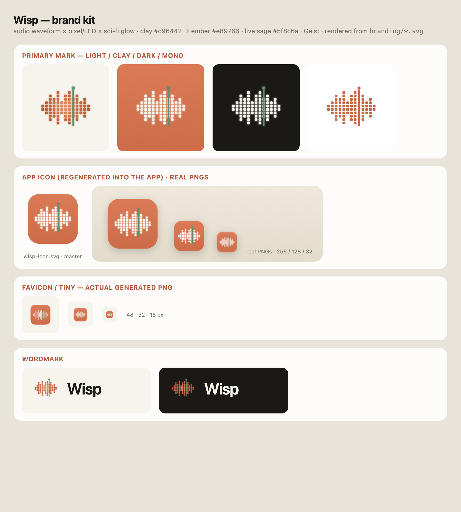

# Wisp — brand kit

A logo for local, real-time, on-device meeting transcription.

## Concept

A **natural audio waveform** rendered as a pixel/LED matrix — voice as sound, the way an
audio editor draws it: mirrored about a centre axis with an organic, rhythmic envelope.
A **sage-green playhead** scans across it: the product's "live / now-transcribing"
signal. A subtle radial gradient (warm clay glowing brighter along the axis) plus a soft
glow give it a quiet sci-fi feel, while staying in the app's warm clay palette — the same
family as Claude's spark.

The keywords it carries: audio-first (waveform), pixel/LED (tech), the glow + scanline
(sci-fi / intelligence), the live playhead (real-time transcription).



## Palette (matches the app's design tokens in `app/src/routes/+page.svelte`)

| Token | Hex | Use |
|---|---|---|
| Clay | `#c96442` | primary mark |
| Ember | `#e89766` | gradient highlight along the axis (glow) |
| Deep clay | `#9c4631` | gradient edge / icon tile |
| Cream | `#f7f4ee` | paper background, reverse mark |
| Ink | `#1a1915` | text, dark background |
| Live sage | `#5f8c6a` | the playhead / recording state |

Type: **Geist** (sans), as used in-app.

## Files

| File | What | Where to use |
|---|---|---|
| `wisp-mark.svg` | gradient waveform + glow + sage playhead | light backgrounds |
| `wisp-mark-reverse.svg` | cream waveform + glow + sage playhead | clay / dark backgrounds |
| `wisp-mark-mono.svg` | single-colour, flat (`currentColor`, defaults clay) | stamps, print, one-colour |
| `wisp-icon.svg` | cream waveform on a clay squircle | **primary app icon** (master for the PNG set) |
| `wisp-wordmark.svg` | mark + "Wisp" | light backgrounds |
| `wisp-wordmark-reverse.svg` | mark + "Wisp" (cream text) | dark backgrounds |
| `wisp-icon-1024.png` | 1024² transparent master | source for regenerating platform icons |
| `brand-sheet.png` | overview render | reference only |

The SVGs are the source of truth. `wisp-mark-mono.svg` inherits the surrounding text
colour via `currentColor` (and drops the glow/gradient), so
`<span style="color:#c96442"><!-- inline svg --></span>` recolours it.

## Regenerating the app icons

The platform icon set (`app/src-tauri/icons/` + `app/static/favicon.png`) is generated
from the 1024² master:

```sh
cd app
npx tauri icon ../branding/wisp-icon-1024.png      # 32/128/@2x PNGs, icon.icns, icon.ico, Square*Logo
sips -z 256 256 ../branding/wisp-icon-1024.png --out static/favicon.png   # browser favicon
```

`tauri icon` also emits `android/`, `ios/`, and `64x64.png`; this desktop MVP doesn't
ship them, so they're removed to keep `icons/` to the set `tauri.conf.json` references.

## Tweaking the mark

The mark is generated from geometry, not drawn by hand. In `generate.py`:

- `HA` — the waveform envelope (per-bar heights). Edit for a different rhythm.
- `S`, `GX`, `GY` — pixel size and gaps (chunkier vs finer LEDs).
- `PLAYHEAD` — which bar the scanline sits on.
- `EMBER` / `CLAY` / `CLAY_D` — the radial gradient stops; `glow_def()`'s `stdDeviation`
  controls how strong the sci-fi glow is.

Run `python3 branding/generate.py` to rewrite every SVG, then regenerate the icons above.
